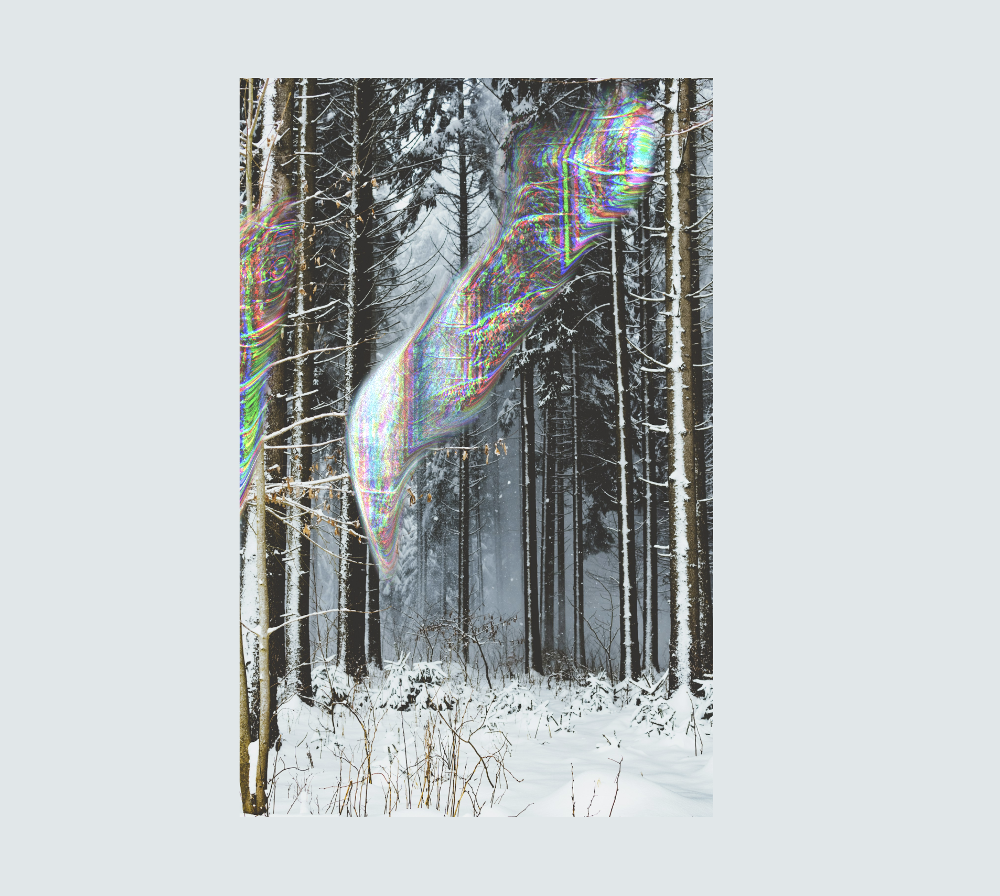

# Ethereal Effect

A chromatic mouse effect built with Three.js shaders.
RGB channels shift apart as your cursor moves, creating a glitchy, liquid distortion.

[Live Demo](https://ethereal-effect.vercel.app/)



## About

An exploration of fragment shaders — chromatic distortion by offsetting RGB channels,
a mask to toggle before/after effects, and shimmering noise that reacts to mouse movement.

## Built with

- [Vite](https://vite.dev/)
- [JavaScript](https://developer.mozilla.org/fr/docs/Web/JavaScript)

## Resources

- [Photo by Benjamin Raffetseder](https://unsplash.com/fr/photos/arbre-nu-brun-Xb4i2JDSjdQ)
- [The Book of Shaders](https://thebookofshaders.com/)

## Run locally

```bash
git clone https://github.com/houmahani/ethereal
cd repo-name
npm install
npm run dev
```

## License

MIT
